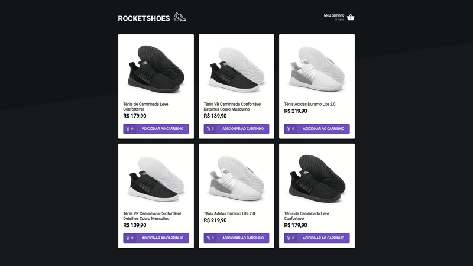
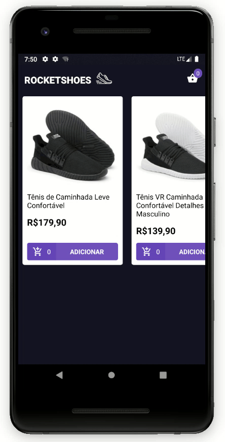

<h1 align="center">
  
</h1>

  <a href="#lista-de-correspondências">Lista de correspondências</a>&nbsp;&nbsp;&nbsp;|&nbsp;&nbsp;&nbsp;
  <a href="#sobre-o-projeto">Sobre o projeto</a>&nbsp;&nbsp;&nbsp;|&nbsp;&nbsp;&nbsp;
  <a href="#execução">Execução</a>&nbsp;&nbsp;&nbsp;|&nbsp;&nbsp;&nbsp;
  <a href="#licença">Licença</a>

---
 

## Lista de correspondências
* Modulo 7: Arquitetura Flux
* [Desafio 7: Arquitetura Flux](./_instruction/Desafio07.md)
* [Desafio 8: Utilizando React Hooks](./_instruction/Desafio08.md)

## Sobre o projeto
Este projeto foi proposto durante o Bootcamp GoStack 10 da rocketseat, o mesmo faz parte de um grupo de atividades e projetos desenvolvidos durante o mesmo, para consultar os demais projetos provenientes deste curso acesso o repositório [GoStack](https://github.com/mauricio-andre/goStack10).

Este projeto apresenta uma interface frontend web e mobile construído com React, esse representa um e-commerce de calçados e seus dados são fornecidos por meio de uma falsa API construída com a lib json-server.

Neste projeto é possível incluir itens do catálogo ao seu carrinho de compras, todo item incluído altera automaticamente a quantidade de itens apresentados no carrinho. Sempre que um novo item é incluído o usuário é redirecionado a tela do carrinho, caso a quantidade de itens incluídos ultrapasse a quantidade disponível em estoque uma notificação é apresentada ao usuário e a quantidade de itens não é alterada.

Este é o resultado do layout do e-commerce para aplicações web

  

 

Este é o resultado do layout do e-commerce para aplicações mobile

  

## Execução
A execução deste projeto parte do principio que seu ambiente tenha o NodeJs e o Yarn instalados.

O processão de execução deste projeto é diferente entre o aplicativo mobile e a versão web, mas para ambas serem executas corretamente é necessário primeiro executar a falsa API de dados, para isso acesse o diretório packages/backend por meio do terminal e execute o comando `yarn dev`.

Para executar a parte web deste projeto, acesse o diretório packages/web e execute o comando `yarn start`

Para executar a parte mobile deste projeto você vai precisar instalar um emulador de celular em seu computador, ou conectar seu dispositivo físico ao computador estando este devidamente configurado para permitir instalações de programas fora da loja oficial de seu provedor. Este projeto não foi testado em um dispositivo IPhone.

Acesse o diretório packages/mobile pelo terminal e execute o comando `yarn android` se o seu dispositivo físico ou emulado for um android, ou `yarn ios` se o mesmo for um IPhone, este comando vai instalar o app em seu celular, após a instalação se o bundle não for executado automaticamente, execute o comando `yarn start`, pode ser necessário fechar e abrir novamente o seu app em seu celular.

## Licença
Esse projeto está sob licença MIT, veja o arquivo de [LICENSE](./LICENSE) para mais detalhes
